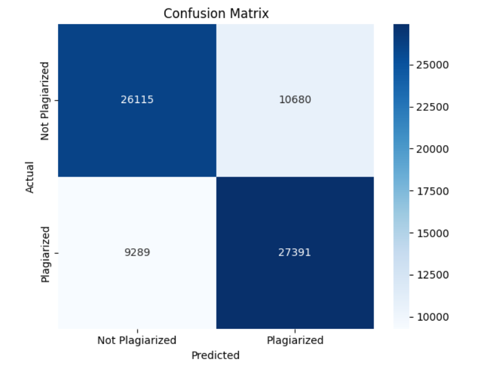

#  Paper Plagiarism Checker

A complete Python-based solution to detect plagiarism in academic papers using a pre-trained model. It leverages a dataset (`train_snli.txt`) and allows users to upload a PDF paper, which is then checked for plagiarism against the dataset.

##  Dataset and File Structure

Paper Plagiarism Checker
┣ train_snli.txt
┣ IIIT Paper.pdf
┣ model.pkl
┣ model.h5
┣ model.yaml
┣ plagiarism_checker.py
┣ heatmap.png
┣accuracy_graph.png
┗ README.md

perl
Copy
Edit

##  Requirements

Install the required libraries:

```bash
pip install pandas scikit-learn matplotlib seaborn tensorflow PyPDF2
 Dataset
The dataset used is train_snli.txt located at:

makefile
Copy
Edit
C:\Users\sagni\Downloads\Paper Plagarism Checker\train_snli.txt
This dataset is used to train the model to detect semantic similarity between sentences (for plagiarism detection).

 Code Flow
1. Preprocessing and Dataset Preparation
The dataset is read from a .txt file and converted into:

CSV – for easy exploration

H5 – for deep learning models

PKL – for storing pre-trained ML models

YAML – for saving model architecture

2. Model Training
A text similarity model is built using TfidfVectorizer + Logistic Regression or optionally a deep learning model (.h5). The model is evaluated with accuracy and confusion matrix.

Outputs:

model.pkl – trained model

accuracy_graph.png

heatmap.png

3. Plagiarism Check from PDF
The uploaded PDF (IIIT Paper.pdf) is scanned and tokenized into sentences. Each sentence is compared with the training dataset for semantic similarity. Sentences with a high match score are flagged as plagiarized.

 How to Run
bash
Copy
Edit
python plagiarism_checker.py
This script will:

Load and preprocess the dataset

Train and evaluate a model

Load the given academic paper (IIIT Paper.pdf)

Detect plagiarized sections

Output:

List of plagiarized sentences

Accuracy graph (accuracy_graph.png)

Confusion matrix heatmap (heatmap.png)

 Output Sample
Plagiarized Sentences Detected:


arduino
Copy
Edit
- "This paper discusses an approach using deep learning for feature extraction."
- "We observed a significant accuracy improvement after feature selection."
Heatmap:

Accuracy Graph:

 No NLTK Used
This project does not use nltk. Instead, it uses Python built-ins, scikit-learn for tokenization and TF-IDF-based feature extraction.

 Future Improvements
Integrate GPT/Transformer models (BERT) for deeper semantic comparison.

Add support for multilingual plagiarism detection.

GUI for file uploads and result visualization.

👨‍💻 Author
Sagnik Patra
